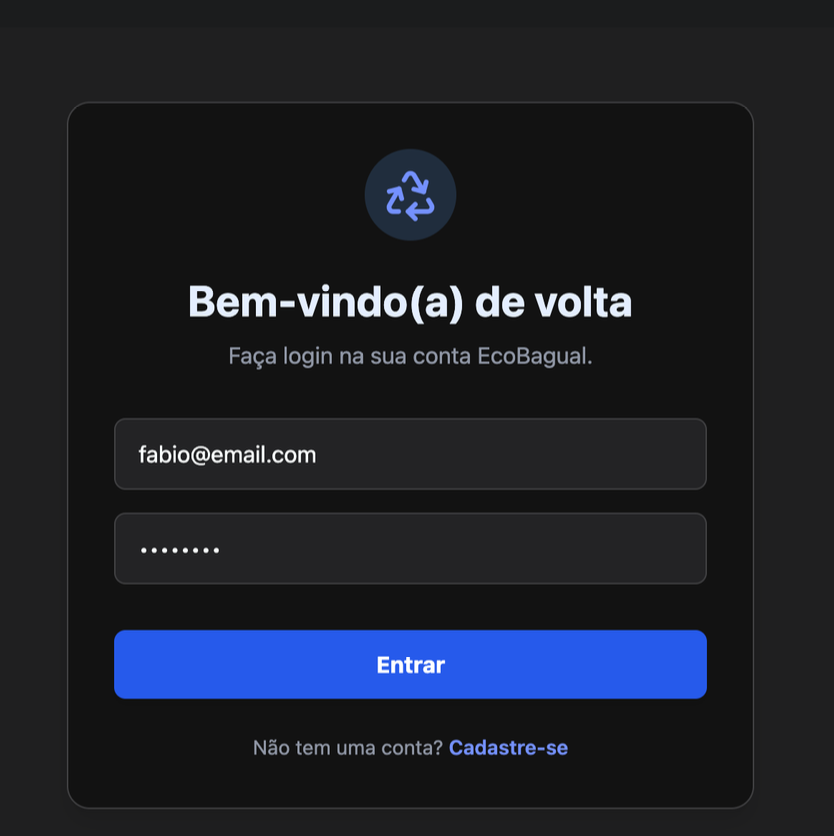

# ♻️ EcoBagual – Economia Circular para Resíduos Eletrônicos

> Protótipo interativo desenvolvido como proposta de inovação social e tecnológica no contexto da disciplina **TI e Sociedade II – Feevale (2025/2)**.

---

## 📌 Descrição do Projeto

**EcoBagual** é uma plataforma digital voltada à **economia circular de resíduos eletrônicos** na cidade de **Porto Alegre – RS**. O objetivo é conectar cidadãos, cooperativas, empresas e ONGs para **promover o descarte adequado, o reaproveitamento de equipamentos** e a **conscientização ambiental**, utilizando tecnologia acessível e estratégias de engajamento digital.

---

## 🧪 Protótipo de Telas

O protótipo foi pensado para simular a experiência completa do usuário com as seguintes telas:

### 1. 🔐 Tela de Login
- Acesso com e-mail e senha para usuários cadastrados.
<table>
  <tr>
    <td align="center"><strong>Tela de Login</strong> </td>
  </tr>
</table>

- Link para novo cadastro.

### 2. 📝 Tela de Cadastro
- Campos básicos: nome, e-mail, senha.
- Primeiro passo para usar o app.

### 3. 🏠 Tela Inicial (Dashboard)
- Boas-vindas personalizadas.
- Saldo de pontos.
- Acesso rápido a recursos como: **Registrar Item**, **Marketplace**, **Rastreamento** e **Histórico**.

### 4. 📦 Tela de Registro de Item
- Cadastro guiado de eletrônicos: tipo + condição.
- Sugestão inteligente: reciclar, reparar ou vender.

### 5. 🛍️ Tela do Marketplace
- **Reciclar:** locais certificados.
- **Consertar:** oficinas especializadas.
- **Vender:** para outros usuários.

### 6. 📍 Tela de Rastreamento de Item
- Rastreabilidade com código único.
- Transparência total do processo, com etapas validadas via *blockchain*.

### 7. 🎁 Tela de Recompensas e Histórico
- Histórico completo de ações realizadas.
- Acúmulo de pontos trocáveis por descontos e benefícios ecológicos.

### 8. 📚 Tela de Conteúdo Educativo
- Artigos e guias sobre:
  - Lixo eletrônico
  - Economia circular
  - Segurança de dados e descarte consciente

---

## 👥 Público-Alvo

- Cidadãos de Porto Alegre
- Cooperativas de reciclagem e oficinas de conserto
- ONGs de inclusão digital e sustentabilidade
- Empresas com práticas ESG
- Escolas técnicas e públicas

---

## 🎯 Objetivos da Plataforma

- Reduzir o descarte inadequado de eletrônicos.
- Incentivar práticas sustentáveis com recompensas.
- Promover a reutilização de equipamentos e inclusão digital.
- Gerar dados e indicadores para políticas públicas (ESG).

---

## 🌱 ODS Alinhados

- **ODS 11** – Cidades e Comunidades Sustentáveis  
- **ODS 12** – Consumo e Produção Responsáveis  
- **ODS 13** – Ação Contra a Mudança Global do Clima  
- **ODS 9** – Indústria, Inovação e Infraestrutura

---

## 📄 Licença

Este projeto está licenciado sob a **Apache License 2.0**, desenvolvido no contexto acadêmico da disciplina **PROJETO – TI e Sociedade II da Universidade Feevale**, com potencial de evolução para aplicações comerciais e de impacto social.

---

## ✉️ Contato

**Fábio Schorn**    
*Desenvolvedor e Aluno do Curso de Análise e Desenvolvimento de Sistemas - Tecnológico*

🔗 [LinkedIn](https://www.linkedin.com/in/fabioschorn/)
🌐 [github.com/fabioschorn](https://github.com/fabioschorn)